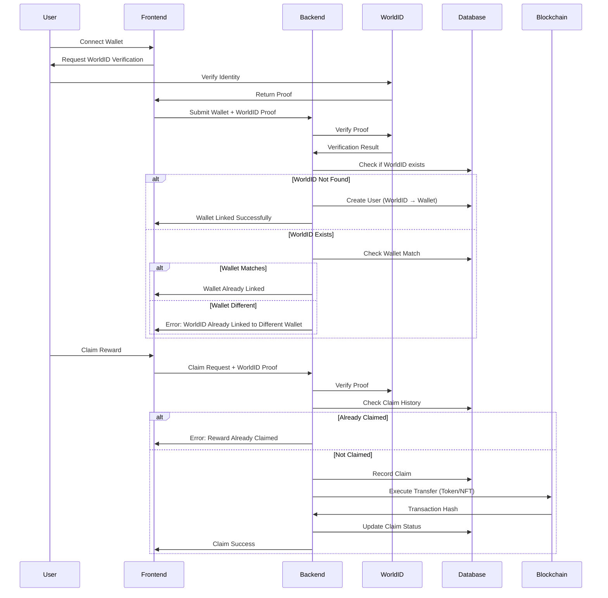

# WorldID Reward Distribution System

## System Architecture

The system prevents duplicate reward claims by using WorldID's uniqueness verification. Each WorldID represents a unique human, and we enforce a strict 1:1 mapping between WorldID and crypto wallet addresses.

### Core Components

1. **Backend API** (Node.js/Express or Python/FastAPI)

   - WorldID verification endpoint
   - Wallet linking and validation
   - Reward distribution logic
   - Admin management endpoints
   - Database for tracking claims and mappings

2. **Database Schema**

   - `users` table: WorldID → Wallet mapping (1:1)
   - `rewards` table: Reward definitions (tokens/NFTs, amounts, distribution rules)
   - `claims` table: Claim history (WorldID, reward_id, status, transaction_hash)
   - `distribution_rules` table: Rules for different distribution types

3. **Frontend** (React/Next.js)

   - User wallet connection (MetaMask, WalletConnect)
   - WorldID verification flow
   - Reward claiming interface
   - Admin dashboard for reward management

4. **Smart Contract Integration**

   - ERC-20 token transfer contracts
   - ERC-721/ERC-1155 NFT contracts
   - Optional: On-chain claim verification (if needed)

## Key Security Features

- **WorldID Verification**: Every claim requires fresh WorldID proof verification
- **One Wallet Per WorldID**: Database enforces 1:1 mapping (WorldID → Wallet)
- **Duplicate Prevention**: Check WorldID uniqueness before processing any claim
- **Transaction Tracking**: Record all claims with transaction hashes for audit

## Data Flow



## Implementation Plan

### Phase 1: Backend Foundation

- Set up backend framework (Node.js/Express or Python/FastAPI)
- Configure database (PostgreSQL recommended)
- Implement WorldID SDK integration
- Create database schema and migrations
- Set up environment configuration

### Phase 2: Core API Endpoints

- `POST /api/auth/worldid-verify` - Verify WorldID proof and link wallet
- `GET /api/user/profile` - Get user's linked wallet and claim history
- `POST /api/rewards/claim` - Claim a reward (with WorldID verification)
- `GET /api/rewards/available` - List available rewards for user
- `POST /api/admin/rewards` - Create/update reward (admin only)
- `GET /api/admin/claims` - View all claims (admin only)

### Phase 3: Blockchain Integration

- Set up Web3 provider (Ethers.js or Web3.py)
- Implement ERC-20 token transfer function
- Implement ERC-721/ERC-1155 NFT transfer function
- Add transaction monitoring and confirmation
- Handle gas estimation and error handling

### Phase 4: Frontend Application

- Set up React/Next.js project
- Integrate wallet connection (wagmi/ethers.js)
- Implement WorldID widget integration
- Build reward claiming UI
- Create admin dashboard
- Add transaction status tracking

### Phase 5: Security & Testing

- Add rate limiting and request validation
- Implement comprehensive error handling
- Add logging and monitoring
- Write unit and integration tests
- Security audit of WorldID verification flow

## File Structure

```
worldid-hackathon/
├── backend/
│   ├── src/
│   │   ├── config/
│   │   │   ├── database.ts
│   │   │   └── worldid.ts
│   │   ├── controllers/
│   │   │   ├── auth.controller.ts
│   │   │   ├── rewards.controller.ts
│   │   │   └── admin.controller.ts
│   │   ├── services/
│   │   │   ├── worldid.service.ts
│   │   │   ├── wallet.service.ts
│   │   │   ├── rewards.service.ts
│   │   │   └── blockchain.service.ts
│   │   ├── models/
│   │   │   ├── user.model.ts
│   │   │   ├── reward.model.ts
│   │   │   └── claim.model.ts
│   │   ├── middleware/
│   │   │   ├── auth.middleware.ts
│   │   │   └── worldid.middleware.ts
│   │   ├── routes/
│   │   │   ├── auth.routes.ts
│   │   │   ├── rewards.routes.ts
│   │   │   └── admin.routes.ts
│   │   └── app.ts
│   ├── prisma/ (or migrations/)
│   │   └── schema.prisma
│   └── package.json
├── frontend/
│   ├── src/
│   │   ├── components/
│   │   │   ├── WalletConnect.tsx
│   │   │   ├── WorldIDVerification.tsx
│   │   │   ├── RewardClaim.tsx
│   │   │   └── AdminDashboard.tsx
│   │   ├── pages/
│   │   │   ├── index.tsx
│   │   │   └── admin.tsx
│   │   ├── hooks/
│   │   │   ├── useWallet.ts
│   │   │   └── useRewards.ts
│   │   └── lib/
│   │       └── api.ts
│   └── package.json
└── README.md
```

## Key Implementation Details

### WorldID Verification

- Use WorldID's SDK to verify proofs on each claim
- Store WorldID nullifier to detect duplicate attempts
- Verify proof freshness (timestamp validation)

### Database Constraints

- Unique constraint on `world_id_hash` in users table
- Unique constraint on `wallet_address` in users table (enforces 1:1)
- Composite unique constraint on `(world_id_hash, reward_id)` in claims table

### Reward Distribution Logic

- Check if WorldID has already claimed this reward
- Verify WorldID proof is valid and fresh
- Check reward distribution rules (one-time, action-based, etc.)
- Execute blockchain transaction
- Record claim in database with transaction hash

### Admin Features

- Create/edit/delete rewards
- Set reward types (token amount, NFT contract + token ID)
- Configure distribution rules (one-time, recurring schedule, etc.)
- View claim statistics and user activity

## Technology Recommendations

- **Backend**: Node.js with Express + TypeScript, or Python with FastAPI
- **Database**: PostgreSQL with Prisma ORM (or SQLAlchemy for Python)
- **WorldID**: `@worldcoin/world-id-lite` SDK
- **Blockchain**: Ethers.js v6 (or Web3.py)
- **Frontend**: Next.js 14 with TypeScript, wagmi for wallet connection
- **Styling**: Tailwind CSS or shadcn/ui

## Security Considerations

1. **WorldID Proof Verification**: Always verify on backend, never trust client
2. **Rate Limiting**: Prevent spam/abuse on claim endpoints
3. **Input Validation**: Validate all wallet addresses and WorldID proofs
4. **Transaction Safety**: Use nonces and proper gas estimation
5. **Admin Authentication**: Secure admin endpoints with proper auth
6. **Database Security**: Use parameterized queries, prevent SQL injection
7. **Environment Variables**: Store private keys and API keys securely